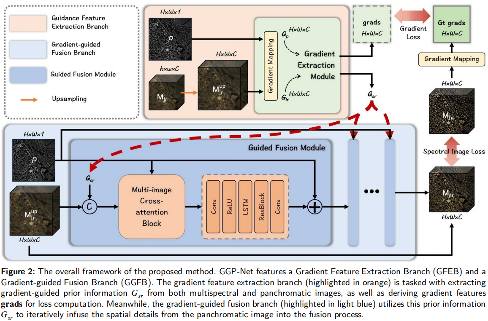

# GGPNet_code
This repository contains the official implementation of our paper 🚀🚀🚀:  
**"Unlocking spatial textures: Gradient-guided pansharpening for enhancing multispectral imagery"**.

Pansharpening aims to integrate the high spatial resolution of panchromatic images (PAN) with the spectral richness of multispectral images (MSI), producing high-resolution multispectral outputs. While deep learning-based approaches have achieved remarkable performance in pansharpening, most methods primarily focus on developing advanced model architectures, often overlooking the potential of manually crafted features. Unlike previous works where gradient information has been primarily utilized in model-based optimization methods, we demonstrate that gradient features derived from the gradient magnitude can provide complementary information that guides the fusion process of PAN and MSI, significantly enhancing pansharpening performance. Specifically, we propose a gradient-guided pansharpening network, termed GGPNet, which consists of two branches: a guidance feature extraction branch that captures gradient features from the gradient magnitude, and a gradient-guided fusion branch that integrates the PAN and MSI with the additional information from gradient features. Within the fusion branch, a multi-image cross-attention block is designed to facilitate the gradual integration of features from images with varying spectral bands and resolutions. Moreover, a gradient loss is introduced to guarantee the effectiveness of the extracted gradient feature information, which is then combined with the widely-used spectral image loss. Extensive experiments on the GaoFen-2 (GF2), QuickBird (QB), and WorldView-3 (WV3) datasets validate the efficacy of our approach, demonstrating its superiority over state-of-the-art methods with substantial improvements in PSNR, ERGAS, and other commonly adopted metrics. The source code will be made publicly available.

## Environment
The code is developed and tested on Ubuntu 18.04 with Python 3.8.5. The following packages are required:
> pip install -r requirements.txt

## Datasets
The code is tested on the following datasets:
- [PanCollection](https://github.com/liangjiandeng/PanCollection)

## Training
To train the model, run the following command:
> python train_GGPNet.py

## Testing
To test the model, run the following command:
> python test_s_sota.py

## Citation
Liang L, Li T, Wang G, et al. Unlocking spatial textures: Gradient-guided pansharpening for enhancing multispectral imagery[J]. Neurocomputing, 2025: 131607.

If you find our work useful, please consider citing our paper.
> @article{liang2025unlocking,
  title={Unlocking spatial textures: Gradient-guided pansharpening for enhancing multispectral imagery},
  author={Liang, Lanyue and Li, Tianyu and Wang, Guoqing and Mei, Lin and Tang, Xiongxin and Qiao, Chaofan and Xie, Dongyu},
  journal={Neurocomputing},
  pages={131607},
  year={2025},
  publisher={Elsevier}
}
